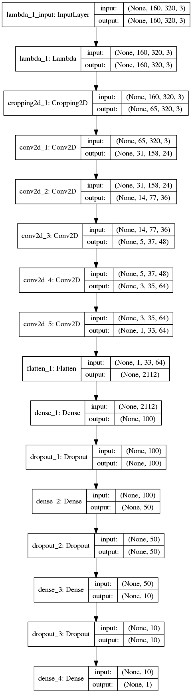

# Behavioral Cloning Project

The goals / steps of this project are the following:
* Use the simulator to collect data of good driving behavior
* Build, a convolution neural network in Keras that predicts steering angles from images
* Train and validate the model with a training and validation set
* Test that the model successfully drives around track one without leaving the road
* Summarize the results with a written report


[//]: # (Image References)

[image1]: ./writeup_images/model.png "Model visualization"
[image2]: ./writeup_images/center_driving.gif "Center driving"
[image3]: ./writeup_images/recovery_driving.gif "Recovery driving"
[image4]: ./writeup_images/left-center-right.png "Left, center, right cam"
[image5]: ./writeup_images/flipped.png "Flipped images"
[image6]: ./writeup_images/right_driving.gif "Right lane driving"
[image7]: ./writeup_images/flipped_left_lane.png "Flipped left lane driving"
[image8]: ./writeup_images/shadows.gif "Shadow examples"
[image9]: ./writeup_images/shadow_hsv.png "HSV decomposition of shadow"
[image10]: ./writeup_images/shadow_comparsion.png "Shadow comparison"
[image11]: ./writeup_images/shadow_measurements.png "Shadow measurements"
[image12]: ./writeup_images/shadows_track1.png "Augmented shadows"
[image13]: ./writeup_images/shadow_stacked.png "Stacked shadows"
[image14]: ./writeup_images/equalization_steering_angles.png "Steering angles equalization"
[image15]: ./writeup_images/training_result.png "Training result"


## Rubric Points
This is how I've addressed the [rubric points](https://review.udacity.com/#!/rubrics/432/view) in my implementation.

### Files Submitted & Code Quality

#### 1. Submission includes all required files and can be used to run the simulator in autonomous mode

My project includes the following files:
* model.py containing the script to create and train the model
* drive.py for driving the car in autonomous mode
* model.h5 containing a trained convolution neural network
* writeup_report.md summarizing the results
* video.mp4 showing the final model drive track 1
* track2.mp4 showing the final model drive track 2

#### 2. Submission includes functional code
Using the Udacity provided simulator and my drive.py file, the car can be driven autonomously around the track by executing
```sh
python drive.py model.h5
```

#### 3. Submission code is usable and readable

The model.py file contains the code for training and saving the convolution neural network. The file shows the pipeline I used for training and validating the model, and it contains comments to explain how the code works.

### Model Architecture and Training Strategy

#### 1. An appropriate model architecture has been employed

My model consists of a convolution neural network with 5x5 and 3x3 filter sizes and depths between 24 and 64 (model.py lines 418-422). Then there are fully connected layers with depths between 10 and 100, with a final output layer providing the steering value (model.py lines 424-430).

The model use RELU activation to introduce nonlinearity for all layers except the output layer where a tanh activation function is used.

The image data is normalized in the model using a Keras lambda layer (model.py line 412).

#### 2. Attempts to reduce overfitting in the model

The model contains dropout layers in order to reduce overfitting (model.py lines 425, 427, 429).

The model was trained and validated on different data sets to ensure that the model was not overfitting (model.py line 547-564). The model was tested by running it through the simulator and ensuring that the vehicle could stay on the track.

#### 3. Model parameter tuning

The model use an Adam optimizer, so the learning rate was not tuned manually (model.py line 557).

The number of epochs was not tuned since the weights are output for each epoch, enabling manual evaluation afterwards.

Other parameters used in the model, mainly concerning the training data configuration, was exposed as input arguments (model.py line 23-32) allowing for easy tuning by running batch scripts with different configurations.

#### 4. Appropriate training data

Training data was chosen to keep the vehicle driving in the center of the road in track 1, and in the right lane in track 2. I used a combination of center lane driving, recovering from the left and right sides of the road, the both side cameras with a (tuned) offset value, augmented images with shadows, and horizontal flip.

For details about how I created the training data, see the next section.

### Architecture and Training Documentation

#### 1. Solution Design Approach

The overall strategy for deriving a model architecture was to start with something already proven to work for this type of application. I choose the model presented in this [NVIDIA blog post](https://devblogs.nvidia.com/parallelforall/deep-learning-self-driving-cars/), which also has been proven to be simple enough to run in real-time on an embedded hardware, which was an inspiration.

When using an already proven model as a starting point, the challenge is mainly in collecting a well balanced data set to train it on. How this was done is explained in more detail in section 3. For the first track, just a few laps in both directions and some recovery sequences did the trick. At this point, the model was however wobbling around the track. To make it more stable, both side cameras were also put into play, with an offset added to the steering angle to compensate for the field-of-view translation. This provided lots of data that learned the model to strive towards the road center instead of neglecting that it's starting to drift off. For the second track, the same data collection strategy was applied but now it become more important to get the data balanced with respect of steering angle, shadows and also the amount of data from each track. To achieve this data equalization, a combination of oversampling, undersampling and image augmentation was used.

When training the model, 20% of the data was reserved for validation. The data equalization mentioned above was not applied on the validation data, so the performance measured on this data set should be about the same as when running the model in the simulator. The loss (mean squared error) measured on the validation set shows if the training is over-fitting, in which case the validation-loss will stop improving or even increase, although the training-loss improves. An over-fitted model is also possible to notice when running the model in the simulator, since the steering becomes very sporadic and change aggressively from frame to frame.

To avoid over-fitting the model, several methods were applied. First and most importantly, the training set was quite large. The data was also gathered and alternated in many different ways to create unique examples that wasn't exactly as when going down the expected track. Dropout layers was also used (in training) to force the model to not rely on just some data path, which also should help prevent over-fitting.

The final model is able to drive around both tracks. In the first track, the vehicle tries to keep the center but this is somewhat biased towards the right side, which probably is because the vehicle is trained to keep the right lane on the second track.

#### 2. Final Model Architecture

The final model architecture (model.py lines 400-432) consisted of a convolution neural network with the following layers

| Layer (type)           | Activation | Output Shape            | Param # |
|:-----------------------|:----------:|:------------------------|:--------|
| Image normalization    |            | (None, 160, 320, 3)     | 0       |
| Cropping2D             |            | (None, 65, 320, 3)      | 0       |
| Conv2D, 5x5 filter     | RELU       | (None, 31, 158, 24)     | 1824    |
| Conv2D, 5x5 filter     | RELU       | (None, 14, 77, 36)      | 21636   |
| Conv2D, 5x5 filter     | RELU       | (None, 5, 37, 48)       | 43248   |
| Conv2D, 3x3 filter     | RELU       | (None, 3, 35, 64)       | 27712   |
| Conv2D, 3x3 filter     | RELU       | (None, 1, 33, 64)       | 36928   |
| Flatten                |            | (None, 2112)            | 0       |
| Dense                  | RELU       | (None, 100)             | 211300  |
| Dropout, keep rate 0.9 |            | (None, 100)             | 0       |
| Dense                  | RELU       | (None, 50)              | 5050    |
| Dropout, keep rate 0.9 |            | (None, 50)              | 0       |
| Dense                  | RELU       | (None, 10)              | 510     |
| Dropout, keep rate 0.9 |            | (None, 10)              | 0       |
| Dense                  | tanh       | (None, 1)               | 11      |

Total params: 348 219

A graph visualization of the architecture is also available [here](./writeup_images/model.png).

<p align="center">
<a href="./writeup_images/model.png" target="_blank"></a>
</p>

#### 3. Creation of the Training Set & Training Process

##### Track 1
The model was trained to keep the center of the road in track 1.

###### Center driving
For the initial training of the first track, 2-3 laps was recorded in both directions. The vehicle was kept in the middle of the road as seen in the examples below.

![alt text][image2]

The other direction was recorded to help generalize the model by providing a different, although still very similar track.

###### Recovery driving
Several short sequences of recovery driving, as the example below, was also recorded. This is to improve the models ability in handling situations where the vehicle has drifted away from the center.

![alt text][image3]


###### Left and right cameras
The left and right cameras are used to provide data where the field-of-view is slightly translated left and right. By adding an offset to the steering angles, this provides samples that corrects small deviations from the expected path in the same way as the recovery sequences corrects large deviations. This learns the model to always strive towards the road center instead of just accepting that the vehicle is drifting off, e.g. until it reach the road border where the knowledge from the recovery data kicks in.

Here's an example showing the different field-of-views.
![alt text][image4]

Since the camera translation and field-of-view wasn't given, the steering offset was tuned by looking at how the model drives the vehicle. If the the offset is too large, then the model will overcompensate and give a wobbly behavior. On the other hand, if the value is too small, the model is comfortable even when drifting away from center. Since it's easier to see when the model is overcompensating, the tuning was done downwards from 0.03 finding a sweet spot at 0.0245.

Because of uncertainty about proper offset values in curves, the left and right cameras were only used when driving fairly straight, as controlled by input argument sharp_turn_threshold.

###### Flipped images
Horizontal flip was applied on all samples in track 1. Apart from providing more training data, this also helps to generalize the model in the same way as when driving in the other direction.

Below are a few examples before and after horizontal flip.

![alt text][image5]

##### Track 2
For the second track, the model was trained to keep the right lane.

###### Right lane driving
As with the first track, both directions was recorded for 2-3 laps, but now driving in the middle of the right lane.

![alt text][image6]

###### Left lane driving
Both directions was also recorded when driving in left lane. But since the model shall be trained to drive in the right lane, these samples was only used together with horizontal flip, making the augmented left lane sample look like it's from right lane driving.

![alt text][image7]

###### Shadow driving
The major problem in track 2 was the shadows, the animation below shows some examples. It almost looked like the vehicle was striving into the shadows. One reason for this might be that shadows only are present during minor parts of track 2 and almost not at all in track 1, making samples with shadows highly underrepresented in the collected data when recording as described above. Since shadow samples are so rare, the model may fail on them and still achieve a decent loss-value. To counter this problem, special recordings of shadow parts from track 2 was added and also oversampled to somewhat balance up the training data.

![alt text][image8]

###### Augment shadows
Another method applied to counter the shadow problem was to augment extra samples with shadows. This was done by first converting the image from BGR to HSV color space. In theory, when alternating the V-channel, this should only change the pixel intensity and not affect colors (Hue and Saturation) that much. However, as seen below in the HSV decomposition of a simulator image, this is not exactly how shadows are implemented in the simulator, i.e. there is a clear distinction for the shadow also in the H- and S-channels.

![alt text][image9]

When comparing RGB values in shadows and sunlight, it looks like the red and green channels are scaled linearly, but that something more fancy is going on with the blue channel. Exactly how the simulator implements shadows was not reverse engineered. Instead, only changing the V-channel was considered to reassemble the simulator shadows good enough. An examples of the difference is shown in the image below, where the augmented shadow is in the bottom and simulator shadow in the top.

![alt text][image10]

The change of intensity to use when augmenting a shadow was reverse engineered from the simulator. Pixels representing the same type of materials, e.g. grass, pavement and lane markings, was measured both in shadow and sunlight. In the resulting scatter plot (see below), it looks like a linear function having a slope of ~0.3 and intercepting (0, 0) will fit pretty well. That is, to augment a shadow pixel, one just need to multiply the V-channel by a factor 0.3.

![alt text][image11]

The purpose of the shadow generator is not to augment realistic shadows, but it should produce images that partly are sunlit and partly in shadow. In this way, the training will be forced to consider both light conditions in the same sample. This was acheived by randomly slicing the images in two parts by a straight line, where one side is made darker by multiplying the V-channel values with the shadow factor 0.3.

![alt text][image12]

To avoid stacking the augmented shadow on top of a real shadow (see example below), this method was only applied on samples from track 1, where there are almost no shadows.

![alt text][image13]


##### Balancing samples
After the collection process, there was nearly 100 000 samples in the data set (including flipped and shadow augmented samples). A problem with this data is that it's imbalanced, mainly regarding steering angles but also special road types and between the both tracks.

###### Steering angles
To counter the imbalanced steering angles, a combination of over and under-sampling are applied to output a data set that are close to equal for all angles. In a first attempt, the angles were made completely equal which however gave bad performance when driving straight forward. So the equalization is now made less aggressive to still have the data biased a little bit towards driving straight. The equalization amount is actually tunable in my model by the input parameter called steering_equality_factor, for which a value of 0.1 was found to give a good balance. Setting the parameter to 0 gives equal distribution, and 1 keeps the distribution imbalanced, so 0.1 is still very close to equal as can be seen in the histogram below.

![alt text][image14]

###### Shadows vs sunlight data
Although there are some augmented track 1 samples with shadows, a data set with only shadows (e.g. labeled simulator samples) was also added and oversampled 2 times to balance up this type of data.

###### Track 1 vs track 2
The final data set ended up having much more samples from track 2. To equalize this, the number of track 1 samples was first increased by a factor 1.5 by augmenting shadows, and then all samples were oversampled 1 time.


##### Training
The data set is randomly shuffled and then split into a training set (80%) and a validation set (20%). The data equalization and oversampling is only done on the training set, so the performance measured on the validation set should be similar to when running the simulator.

To be able to handle all the training examples they are loaded from hard-disk drive (HDD) only when needed by the training. This is made possible by using the Keras fit_generator() which takes a batch-generator instead of a huge list of samples. The batch generator can then load images from HDD, apply augmentation such as shadows and/or horizontal flipping as specified in the sample, and then yield the batch to the training-function.

The number of epochs needed to over-fit the model scaled up as the amount of data increased. With the final data set it's not obvious when looking at the validation loss if the model has over-fit the training data even after 50 epochs. The actual performance of the model (when running in the simulator) does also seem to improve at least up to 20-30 epochs.

![alt text][image15]

Another problem when evaluating the training result is that the validation loss does not seem to be a good measure for the models actual performance in the simulator. So instead of looking at the validation loss to understand when to stop a training, the model weights are saved for every epoch and then the evaluation is done manually afterwards in the simulator. It was however not very easy to decide if one model performed better than another. If continuing this project, e.g. by trying to optimize the model further, it would be necessary to come up with some automatic way to measure how good it performs. Maybe extracting and analyzing the steering angles, speed, etc when running the simulator in autonomous mode could provide measures for how smoothly the model is driving. Such an analyze would however be so much easier if the simulator also provided a "GPS signal" as ground truth.

The Adam optimizer was used so it wasn't necessary to tune the learning rate. The batch size was set to 64 samples without confirming this to be a good choice.


### Final result
Video files showing the final model drive around [track 1](./video.mp4) and [track 2](./track2.mp4) are available in the repository. The vehicle speed is set to 30 resp. 15 mph. For the second track, the model seems to be able keep the right lane up to ~20 mph without that much problem. Forcing it to drive faster shows that the model is quite good at recovering into the right lane, but when the speed reach ~23 mph it will sooner or later crash.
